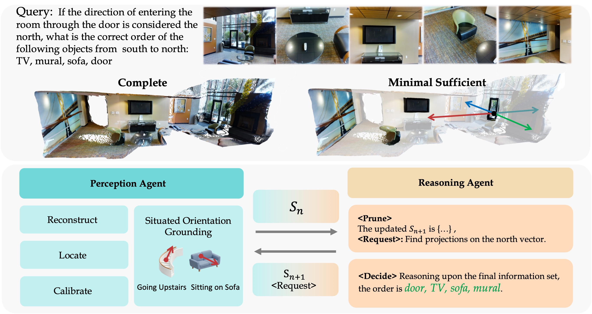
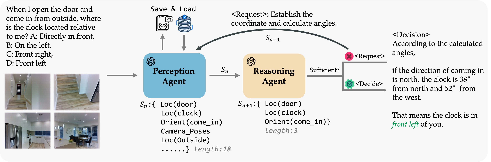

# Pursuing Minimal Sufficiency in Spatial Reasoning
Yejie Guo, Yunzhong Hou, Wufei Ma, Meng Tang, Ming-Hsuan Yang

Spatial reasoning in Vision-Language Models (VLMs) remains limited by weak 3D understanding and redundant scene information. **MSSR** (Minimal Sufficient Spatial Reasoner) tackles these challenges through a dual-agent framework that explicitly builds a Minimal Sufficient Set (MSS) of 3D knowledge before reasoning.
A Perception Agent extracts compact yet sufficient spatial cues from expert models (with our new SOG module for robust orientation grounding), while a Reasoning Agent refines and prunes information in a closed loop.
This approach leads to more accurate, interpretable, and efficient 3D reasoning, achieving state-of-the-art results on challenging benchmarks.



We have released the implementation of the modules we designed (e.g., SOG). Full code will be released soon. Please stay tuned.

## Acknowledgements
We would like to thank the following works for their contributions to the community and our codebase:
* [VADAR](https://github.com/damianomarsili/VADAR)
* [VGGT](https://github.com/facebookresearch/vggt)
* [GroundingDINO](https://github.com/IDEA-Research/GroundingDINO)
* [SAM2](https://github.com/facebookresearch/sam2)

## Citation
If you find our work useful, please consider citing our paper as follow:
```
@misc{guo2025pursuingminimalsufficiencyspatial,
      title={Pursuing Minimal Sufficiency in Spatial Reasoning}, 
      author={Yejie Guo and Yunzhong Hou and Wufei Ma and Meng Tang and Ming-Hsuan Yang},
      year={2025},
      eprint={2510.16688},
      archivePrefix={arXiv},
      primaryClass={cs.CV},
      url={https://arxiv.org/abs/2510.16688}, 
}
```