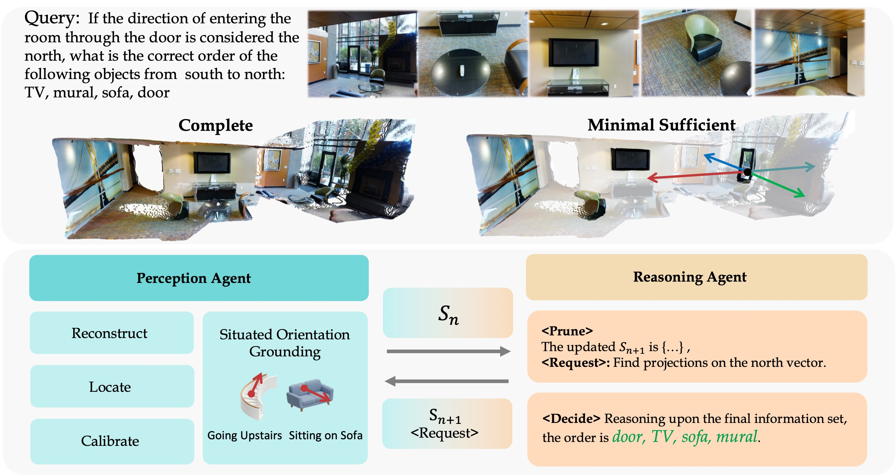
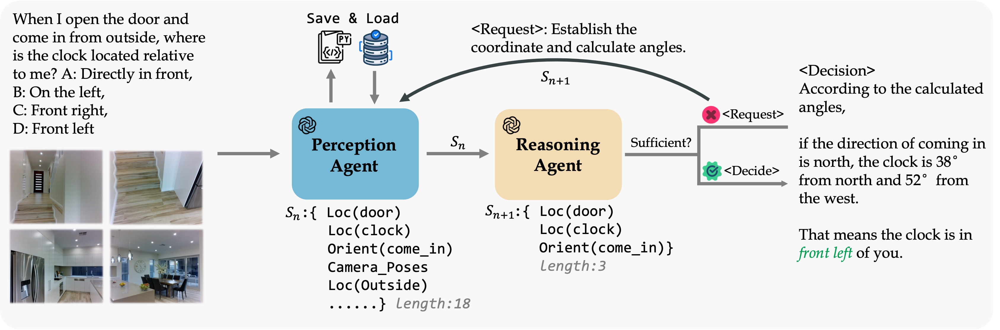

# MSSR: Minimal Sufficient Spatial Reasoner

Official implementation of **Pursuing Minimal Sufficiency in Spatial Reasoning**, ICLR 2026.

Yejie Guo, Yunzhong Hou, Wufei Ma, Meng Tang, Ming-Hsuan Yang

[Paper](https://arxiv.org/abs/2510.16688) · [Full text (HTML)](https://arxiv.org/html/2510.16688v2) · [ICLR / OpenReview](https://openreview.net/forum?id=bZAKJwyn1n) · [Research overview](docs/index.html) · [BibTeX](CITATION.bib)

MSSR is a zero-shot, training-free dual-agent framework for **multi-view 3D spatial reasoning**. It combines expert perception tools with iterative evidence pruning, helping a vision-language model answer spatial questions from a compact, sufficient set of 3D information.

## How MSSR works

Given multiple images of the same scene and a natural-language question, MSSR builds a **Minimal Sufficient Set (MSS)** of spatial evidence before answering.

1. **Perceive:** a Perception Agent writes Python to call expert vision modules, including VGGT for reconstruction, GroundingDINO and SAM2 for object localization, and geometric computation tools.
2. **Ground directions:** Situated Orientation Grounding (SOG) uses visual prompts and coarse-to-fine candidate selection to map language-conditioned directions to 3D vectors.
3. **Curate:** a Reasoning Agent removes evidence irrelevant to its question-specific plan and requests missing information from the Perception Agent.
4. **Answer:** final reasoning uses the curated evidence set, with prior context discarded. The loop approximates the MSS; it does not certify a globally optimal minimum.




## Reported results

Accuracy (%) from [arXiv v2, Table 1](https://arxiv.org/html/2510.16688v2#S4.T1). These are paper-reported results under its evaluation settings, not new measurements or a claim about the current leaderboard.

| Method | MMSI-Bench | ViewSpatial-Bench |
| --- | ---: | ---: |
| GPT-4o baseline | 30.3 | 35.0 |
| MSSR with GPT-4o | **49.5** | **51.8** |
| Absolute improvement | +19.2 points | +16.8 points |

## Research scope

MSSR is relevant to training-free multi-view spatial question answering, tool-augmented vision-language agents, visual programming, and question-conditioned information selection. Its SOG module addresses language-grounded orientation, including object-facing and situation-dependent directions. The paper also explores using grounded reasoning traces as supervision in a separate preliminary fine-tuning experiment.

The main framework uses pretrained models without task-specific training. Training-free does not mean model-free or compute-free: local vision models and language-model inference are still required. Reconstruction, localization and orientation errors can propagate to the answer; iterative inference also incurs API latency. See [the paper's limitations](https://arxiv.org/html/2510.16688v2#A11).

For a fuller explanation, read the [research note](docs/research-note.md).

## Setup

### 1. Environment

```bash
conda create -n mssr python=3.10
conda activate mssr
pip install -r requirements.txt
```

### 2. Install Sub-modules

```bash
cd src/models/GroundingDINO && pip install --no-build-isolation -e . && cd ../../..

cd src/models/sam2 && pip install -e . && cd ../../..

cd vggt && pip install -e . && cd ..
```

### 3. Download Model Weights

```bash
bash scripts/download_weights.sh
```

### 4. API Key

We use LLM APIs for code generation and reasoning. Set one of the following environment variables based on your provider:

```bash
# Option 1: Google Gemini (recommended for gemini-* models)
export GOOGLE_API_KEY="your-google-api-key"

# Option 2: OpenAI (for gpt-* models)
export OPENAI_API_KEY="your-openai-api-key"

# Option 3: Custom OpenAI-compatible endpoint
export API_BASE_URL="https://your-endpoint.com/v1"
export API_KEY="your-api-key"
```

### 5. Prepare Datasets

```bash
python scripts/prepare_datasets.py --dataset all
```

This downloads raw data from HuggingFace ([MMSI-Bench](https://huggingface.co/datasets/RunsenXu/MMSI-Bench), [ViewSpatial-Bench](https://huggingface.co/datasets/lidingm/ViewSpatial-Bench)), extracts images, and generates the annotation JSON files.

## Usage

All commands should be run from the **project root** directory.

> **Model selection:** Please use `--model-name gpt-4o` to reproduce the paper results. For development and experiments, we recommend `gemini-3.1-flash-lite-preview`, it is significantly cheaper while achieving comparable performance. In principle, any VLM with an OpenAI-compatible API can be used by setting `API_BASE_URL` and `API_KEY`.

### Interactive Mode

Process individual questions interactively:

```bash
python src/runner_2agents.py \
    --model-name gemini-3.1-flash-lite-preview \
    --annotations-json dataset/MMSI-Bench/mmsi_bench.json \
    --image-pth dataset/MMSI-Bench
```

### Batch Evaluation

Evaluate on the full dataset:

```bash
# Quick test with 10% subset
CUDA_VISIBLE_DEVICES=0 python src/batch_2agent_runner.py \
    --model-name gemini-3.1-flash-lite-preview \
    --subset-ratio 0.1

# Full MMSI-Bench evaluation
CUDA_VISIBLE_DEVICES=0 python src/batch_2agent_runner.py \
    --model-name gemini-3.1-flash-lite-preview \
    --annotations-json dataset/MMSI-Bench/mmsi_bench.json \
    --image-pth dataset/MMSI-Bench

# ViewSpatial-Bench evaluation
CUDA_VISIBLE_DEVICES=0 python src/batch_2agent_runner.py \
    --model-name gemini-3.1-flash-lite-preview \
    --annotations-json dataset/ViewSpatial-Bench/ViewSpatial-Bench_processed.json \
    --image-pth dataset/ViewSpatial-Bench
```

### Use multiple gpus (one process per gpu)

```bash
python src/distributed_batch_runner.py \
    --model-name gemini-3.1-flash-lite-preview \
    --gpu-ids "0,1,2,3" \
    --annotations-json dataset/MMSI-Bench/mmsi_bench.json \
    --image-pth dataset/MMSI-Bench
```

## Visualization

A Flask-based web tool is provided for inspecting results:

```bash
python dual_agent_viewer.py
```

Then open `http://localhost:5000` in your browser. You can also specify a custom results directory:

```bash
DUAL_AGENT_RESULTS_PATH=/path/to/results python dual_agent_viewer.py
```

The viewer allows browsing:
- PA-generated code and execution traces per iteration
- RA reasoning, information curation, and decision logs
- MSS evolution across iterations
- Per-question correctness and statistics

## Acknowledgements
We would like to thank the following works for their contributions to the community and our codebase:
* [VADAR](https://github.com/damianomarsili/VADAR)
* [VGGT](https://github.com/facebookresearch/vggt)
* [GroundingDINO](https://github.com/IDEA-Research/GroundingDINO)
* [SAM2](https://github.com/facebookresearch/sam2)

## Citation

The preferred citation is the ICLR 2026 conference paper. The 2025 arXiv preprint and its later revisions are versions of the same work.

```bibtex
@inproceedings{guo2026pursuing,
 author = {Guo, Yejie and Hou, Yunzhong and Ma, Wufei and Tang, Meng and Yang, Ming-Hsuan},
 booktitle = {International Conference on Learning Representations},
 pages = {121192--121222},
 title = {Pursuing Minimal Sufficiency in Spatial Reasoning},
 url = {https://proceedings.iclr.cc/paper_files/paper/2026/file/c4ff64d68ba491b9048f00d25690d363-Paper-Conference.pdf},
 volume = {2026},
 year = {2026}
}
```
